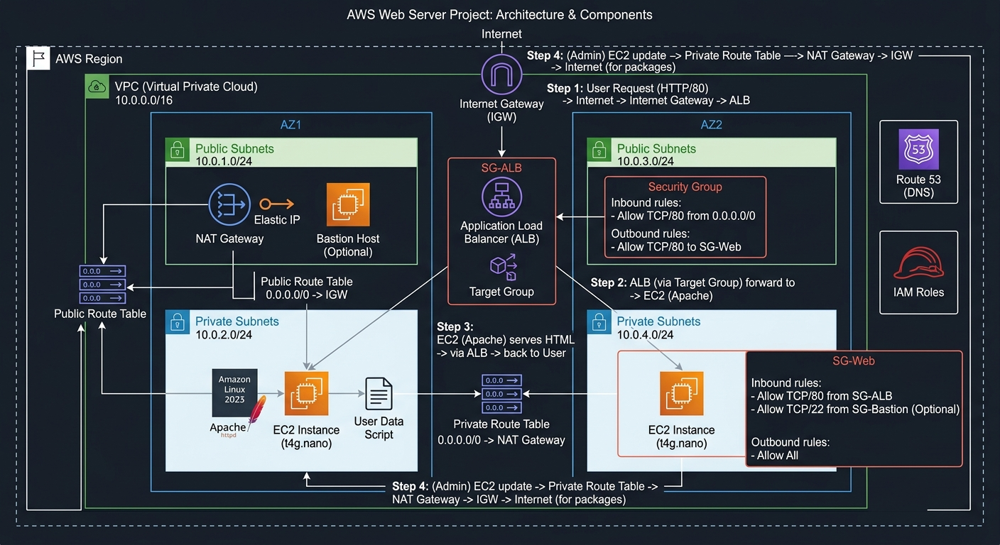

# Proyecto de ejemplo de terraform en AWS - terraform ec2 webserver

En este proyecto de ejemplo se mostrará como utilizar terraform para desplegar una instancia de EC2 exponiendo un servidor web a internet público. El servidor web expondrá un archivo html con una página web simple.

Las componentes del proyecto serán las siguientes:

## Arquitectura del proyecto terraform ec2 webserver

### 1. Capa de Red y Conectividad (VPC Core)

* AWS VPC (Virtual Private Cloud): La red lógica aislada (ej. bloque CIDR 10.0.0.0/16).
* Internet Gateway (IGW): Permite la comunicación pública entre la VPC e Internet.
* Subnets (Subredes):
    * Public Subnet: Rango de IPs (ej. 10.0.1.0/24) configurado para asignar IPs públicas automáticamente.
    * Private Subnet: Rango de IPs (ej. 10.0.2.0/24) sin acceso directo desde el exterior.
* Route Tables (Tablas de Ruteo):
    * Public Route Table: Asociada a la subnet pública con una ruta 0.0.0.0/0 apuntando al Internet Gateway.
    * Private Route Table: Asociada a la subnet privada con una ruta 0.0.0.0/0 apuntando al NAT Gateway.
* NAT Gateway (+ Elastic IP): Se despliega dentro de la Public Subnet y requiere una IP elástica (EIP) estática. Permite a la instancia EC2 instalar y actualizar paquetes desde Internet de forma saliente sin quedar expuesta públicamente.

### 2. Capa de Cómputo e Infraestructura (EC2 & Servidor Web)
* Instancia EC2 (Ubicada en la Private Subnet):
    * Tipo de Instancia: t4g.nano (familia ARM Graviton) o t3a.nano / t2.nano (x86). Son las opciones ultra pequeñas y económicas de la capa de cómputo.
    * AMI (Amazon Machine Image): Amazon Linux 2023.
* User Data Script: Script de automatización de inicio para instalar y levantar el servidor web Apache (httpd) al crear la instancia.

```Bash
#!/bin/bash
dnf update -y
dnf install -y httpd
systemctl start httpd
systemctl enable httpd
```

### 3. Capa de Balanceo de Carga y Acceso Público
Como la instancia EC2 se ubica de forma segura en la Private Subnet, requiere un intermediario en la Public Subnet para recibir el tráfico público:

* Application Load Balancer (ALB):
    * Ubicación: Desplegado en la Public Subnet.
    * Configuración: Expone la IP pública / DNS con la que interactúan los usuarios en Internet.
* Target Group: Registra la instancia EC2 privada en el puerto 80 para redirigir las peticiones entrantes del ALB hacia la máquina de cómputo.

### 4. Capa de Seguridad (Firewalls Virtuales)
* Security Group del ALB (sg-alb):
    * Inbound (Entrada): Permite tráfico en el puerto HTTP (80) desde cualquier origen (0.0.0.0/0).
    * Outbound (Salida): Permite tráfico saliente hacia el Security Group de la EC2.
* Security Group de la EC2 (sg-web-ec2):
    * Inbound (Entrada): Permite tráfico en el puerto HTTP (80) únicamente si proviene del sg-alb.
    * Outbound (Salida): Permite tráfico saliente hacia 0.0.0.0/0 (necesario para pasar por el NAT Gateway y descargar paquetes mediante dnf).

## Resumen del Flujo

1. El usuario accede al nombre de dominio/DNS del Application Load Balancer en el puerto 80.
2. El ALB recibe la solicitud a través del Internet Gateway y evalúa la regla del Security Group del ALB.
3. El ALB reenvía la petición al Target Group, donde está la instancia EC2 privada (t4g.nano / t3a.nano).
4. El Security Group de la EC2 valida que el origen sea el ALB y entrega la página HTML procesada por Apache httpd.

## Diagrama de la arquitectura


